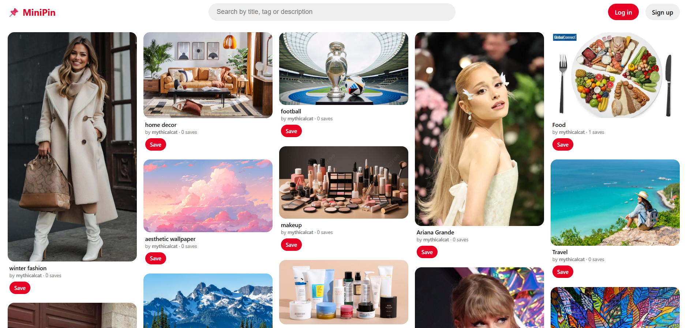
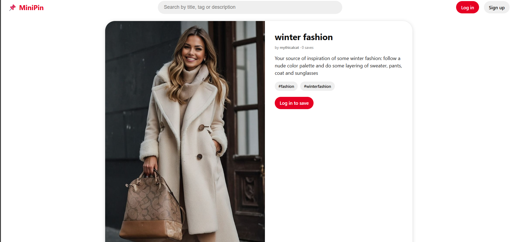
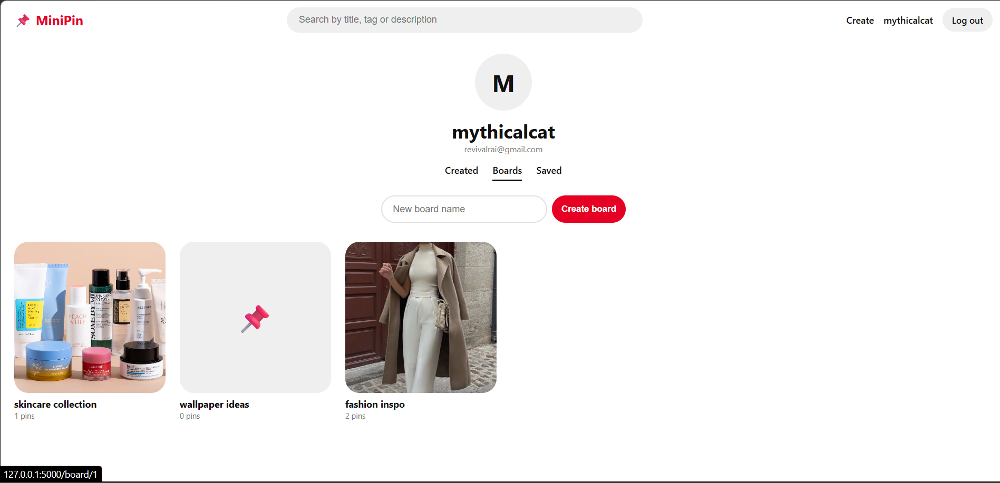

# 📌 MiniPin

A Pinterest-inspired image-sharing web app built with **Flask** and **SQLite**.
Users can sign up, upload pins, organize them into boards, and discover content through search.

## Screenshots

### Home feed


### Pin detail


### Boards


## Features

- 🔐 **Authentication**: sign up, log in, log out (passwords hashed with Werkzeug)
- 🖼️ **Create pins**: upload an image with a title, description and tags
- 🧱 **Masonry feed**: Pinterest-style responsive grid built with pure CSS
- 🔍 **Search**: matches title, description and tags
- 📄 **Pin detail page**: large image, description, clickable tag chips, creator and save count
- ❤️ **Save / unsave**: quick-save any pin to your personal Saved tab
- 📌 **Boards**: create named collections, add or remove pins, delete boards
- 👤 **Profiles**: Created, Boards and Saved tabs
- 🗑️ **Delete pins**: only the owner can delete (enforced on the server)

## Tech Stack

| Layer | Technology |
|---|---|
| Backend | Python, Flask |
| Database | SQLite (built-in `sqlite3`) |
| Frontend | HTML, Jinja2 templates, CSS |
| Security | Werkzeug password hashing, session cookies, parameterized SQL queries |

## Project Structure

```
minipin/
├── app.py               # routes, database, auth logic
├── requirements.txt
├── static/
│   ├── style.css
│   └── uploads/         # uploaded pin images (not tracked by Git)
└── templates/
    ├── base.html        # shared navbar and layout
    ├── index.html       # home feed
    ├── pin.html         # pin detail page
    ├── board.html       # single board
    ├── profile.html     # user profile (Created / Boards / Saved)
    ├── create.html      # upload a pin
    ├── login.html
    ├── signup.html
    └── _pin.html        # reusable pin card
```

## Getting Started

**1. Clone the repository**
```bash
git clone https://github.com/<your-username>/minipin.git
cd minipin
```

**2. Create and activate a virtual environment**
```bash
# Windows
python -m venv venv
venv\Scripts\activate

# Mac/Linux
python3 -m venv venv
source venv/bin/activate
```

**3. Install dependencies**
```bash
pip install -r requirements.txt
```

**4. Run the app**
```bash
python app.py
```
Open **http://127.0.0.1:5000** in your browser. The database (`minipin.db`) and the uploads folder are created automatically on first run.

### Optional environment variables

| Variable | Purpose |
|---|---|
| `SECRET_KEY` | Signs session cookies. Set a long random value in production. |
| `FLASK_DEBUG` | Set to `1` to enable debug mode during development. |

## Database Schema

- `users` (id, username, email, password_hash)
- `pins` (id, title, image, description, tags, user_id, created_at)
- `saves` (user_id, pin_id)
- `boards` (id, user_id, name, created_at)
- `board_pins` (board_id, pin_id)

## Roadmap

- [ ] Hover overlay and "⋯" menu on pins
- [ ] Category chips and left sidebar
- [ ] Infinite scroll
- [ ] "Picked for you" feed using TF-IDF + cosine similarity
- [ ] CSRF protection (Flask-WTF)
- [ ] Deployment

## Notes

This is a learning project and is not affiliated with Pinterest.

